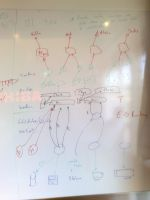
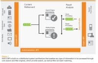

# Search-driven Business Intelligence

## Kort om [Search-driven Business Intelligence](Search-driven-Business-Intelligence.md)

### Key features

- 70% of key data is unstructured.
- Real-time data
- Real-time alerts/action
- Good support for unstructured data
  * file formats
- Rich correlation

### Schematic

How to do data analysis when the amount of unstructured data just increases?

Search-driven technology: Real-time data aquisition (indexing).
Movement:Getting better support for auto-structuring, entity extraction, correlation.

---

### Products

#### [FAST ESP](http://www.fastsearch.com/thesolution.aspx?m=376)

