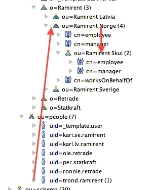

# Copy of Bruker-strukturer

# Esktrakt fra ICS-prosjektet

Orginal: [retrade:(Bruker-strukturer)](../retrade/Bruker-strukturer.md)

### Hovedstruktur

Alle partnere, brukere og applikasjoner/rettigheter ligger i en trestruktur under "icspartner"

Strukturen er bygget opp slik at man kobler en bruker til en "rolle-gruppe" hos en parter (eks. Trond Ramirent er "employee" hos Ramirent)

Partners "rolle-gruppe" kobles til en eller flere roller i systemet (eks. Employee koblet til rolle "writer" i product manager)

Rollene i systemet kobles til rettigheter for hvert område (eks. er "writer" koblet til "write, read, transferToAuction")

Bruker har rettigheter i den organisasjonen vedkommende tilhører samt alle under-organisasjoner. (Eks. Trond Ramirent har rettigheter i Ramirent Norge og derfor også Ramirent Skui)

### Roller og rettigheter

Styres under ou=apps. Roller i **uthevet** er det som normalt skal brukes for partnere.

### Organisatoriske roller (forslag)
 
| Rollenavn | Beskrivelse | Anbefalt systemrolle |  |
| --- | --- | --- | --- |
| employee | default gruppe, alle rettigheter i organisasjonen | assetManager |  |
| management | organisasjonens ledelse | assetGuest |
| accounting | for regnskap/revisjon | assetGuest |  |
| workshopPartner | Verkstedpartner skal ikke overføre, men utlevere (midl.rolle) | assetEditor, assetSurplus |  |
 

### Product manager systemroller
 
| System-rollenavn | Beskrivelse |  |
| --- | --- | --- |
| admin | Systemadmin, typisk kundeservice. |  |
| **assetManager** | tilgang til assets og administrasjon av dem samt innlogging Retrade |
| **assetEditor** | tilgang til å endre assets, ikke Retrade-tilgang |
| **assetGuest** | tilgang til å lese assets (pt. ikke ferdig, har edit), ikke Retradetilgang |
| **assetSurplus** | tilgang til å logge inn på Retrade (sv. "Sales-report") |  |
| vendoAuction | lov til å endre status på produkt (dvs. Vendo-rolle) |
| ics | som AssetManager, men med tilgang til alle partnere |  |
 

### Product manager rettigheter
 
| Rettighetnavn | Beskrivelse |  |
| --- | --- | --- |
| guiAssetAccess | tilgang til Asset Manager GUI |
| statusUpdate | har lov til å sette status på produktet - brukes for Vendo |
| editProductStructure | administrere produktstruktur |  |
| manageAllPartners | gir rettighet til å hente ut en partnerliste for hele organisasjonen som trengs for å kunne legge til produkter eller se på rapporter for hele organisasjonen |  |
| overrideTaxAndMarkup | overstyre tax og markup på produktnivå |  |
| overrideTransferToAuction | overstyre overføring til auksjon (prod. som allerede er overført) |
| restAssetAccess | tilgang til Asset manager backend |  |
| restAssetEvent | gir lov til å konsumere endringer på data (assets). Når noen oppdaterer et asset blir endringen logget og publisert. |
| transferToAuction | overføring av produkter til auksjon |  |
| guiSalesReportAccess | tilgang til Vendo-rapportene |
