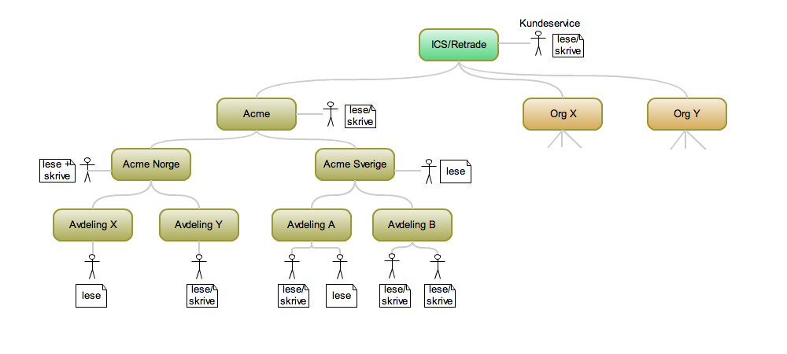

# Copy of LDAP for tilgangskontroll og autentisering

# Dette er et ekstrakt fra ICS-prosjektet

# Dagens løsning (per 25.10.2010)
Slik det er gjort i dagens løsning så har hver organisasjon kun én bruker. Det er behov for å kunne etablere et hierarki for hver organisasjon, f.eks Acme, Acme Norge, Acme Sverige, hvor hver organisasjon kan ha ulike rettigheter (kun les, les/skriv etc).

**Teknisk løsning**
- Apache Directory Server
- Spring Security

# Krav til applikasjonen
Denne seksjonen lister de ulike kravene som er identifisert

1. En organisasjon skal kunne ha vilkårlig antall underorganisasjoner som igjen kan ha underorganisasjoner
1. Rettigheter er knyttet til en bruker
1. Rettigheter som kan tildeles er:
    1. Rettigheter for sidetilgang:
        - Adminrettigheter - tilgang til alle sider
        - Alle andre - tilgang til alle sider utenom adminsider
    1. Rettigheter for dataaksess
        - Registere/Endre objekter
        - Overføre objekt til auksjon
        - Lesetilgang
1. Det skal være mulig å knytte en bruker til en mor-organisasjon (dvs en organisasjon som har organisasjoner under seg). Rettighetene til slike brukere vil gjelde for alle barn-organisasjoner
1. Brukere skal ha disse egenskapene
    - Land
1. Retrades kundeservice skal kunne jobbe på vegne av alle kunder (f.eks at noen i kundeservice må inn å rydde opp for en ting som er lagt inn av en kunde)

## Konseptuell løsning: Hierarki

## Konseptuell løsning: Vendointegrasjon
For å autentisere brukere mot Vendo (håndtering av auksjoner), så må man i Retradeapplikasjonen gjøre mapping fra den innloggede brukeren til organisasjonen som er registrert hos Vendo.

# Forslag til LDAP-struktur
For å dekke kravene over er det laget en eksempelstruktur som beskrives her, se figurer under.

Strukturen er delt inn i tre hoveddeler, users, partners og apps.

- users
Under denne noden legger man inn alle brukere. Hver bruker har en liste (groupOfUniqueNames) som angir hvilke roller i organisasjonsstrukturen (under partners-noden) de er tildelt. I tillegg har de en ou-link som indikerer hvilken organisasjon under partners-noden som er ansvarlig for denne brukeren.

- partners
I denne strukturen legger man inn organisasjonsstrukturen for hver av partnerene. For hver node i organisasjonsstrukturen så kan man legge inn en eller flere organisasjonsroller (f.eks manager, worksOnBehalfOf, employee). Dette er lister (groupOfUniqueNames) med referanser til applikasjonsroller under apps-noden. Disse listen angir altså hvilke rettigheter som er knyttet til en organisasjonsrolle. Rettighetene til en applikasjonsrolle gjelder for noden den er tilknyttet samt alle barn. Det vil f.eks si at man kan gi kundeservice rettigheter for alle organisasjoner ved å knytte en applikasjonsrolle til ou=partners-noden. Da vil de automatisk få tilgang til eventuelle nye organisasjoner som blir lagt til. 

- apps
Denne noden klassifiererer de ulike typene applikasjoner som er i systemet. For hver applikasjon så angir man hvilke roller og rettigheter som gjelder. I utgangspunktet er det kun RPM som er en applikasjon, men dette legger til rette for endring hvis det kommer flere applikasjoner senere. Hver applikasjon har en rollenode og en rettigheternode. Rettighetsnoden inneholder alle typer rettigheter som er relevante for en gitt applikasjon (f.eks read, write, transferToAuction). Rollenoden inneholder ulike roller for en gitt applikasjon. En rolle er en liste med referanser til rettigheter som gjelder for rollen. På denne måten kan man endre hvilke rettigheter som gjelder for en rolle, uten at man trenger å oppdatere hver bruker.

Merk: rettigheter, organisasjonsroller og applikasjonsroller er kun forslag; de må tilpasses etter behov.

### Illustrasjon: Overordnet
Figuren under viser struktur og noen av referansene

Figuren under viser utsnitt tatt fra Apache Directory Studio.

### Illustrasjon: Hvordan koble organisasjonsenheter, land og vendo-id
For å knytte en organisajonsenhet til et land og eventuelt en vendo-id så gjøres det via en egendefinert auxillary objectClass kalt icspartnerOrganizationalInfo.

### Egendefinert LDAP-skjema
Det er opprettet et eget LDAP-skjema for ICS-partner for å håndtere noen av kravene. Dette skjemaet må importeres til Apache DS før selve LDIF-filen kan importeres.

Dette dekker følgende behov: 
- å kunne hekte på country og vendo-id på vilkårlig sted i organisasjonsstrukturen.
- å definere egne tilgangstyper
- å definere hvilken style som skal brukes per organisasjonsenhet (f.eks bestemme hvilken partnerlogo som brukes, evt stylesheet)

For å opprette egne klasser og attributter må man bruke et unikt navnerom. I Norge har Brønnøysundsregisteret følgende OID: 1.3.6.1.4.1.2428.10000. Alle bedrifter i Norge med et organisasjonsnummer kan bruke OID-er under følgende struktur: 1.3.6.1.4.1.2428.10000.<tre første siffer i org.nr>.<seks siste siffer i org.nr>. Det betyr at ICSpartner har følgende navnerom: 1.3.6.1.4.1.2428.10000.990.374406

Forslag til navnestandard:
1.3.6.1.4.1.2428.10000.990.374406.1.1 = Object Classes
1.3.6.1.4.1.2428.10000.990.374406.1.2 = Attribute types

# Fremtidige endringer
For å kunne håndtere endringer som man vet allerede nå vil komme så er det gjort noen grep i LDAP-strukturen. Det gjelder klassifisering av ulike typer applikasjoner. Per i dag er det kun to eksisterende applikasjoner, RPM-server og RPM-client. 

Det foreslås tre kategorier:
- Administrative
- Integrasjon
- Eksterne

Hensikten med å klassifisere applikasjonene er å kunne håndtere de ulike behovstypene på en fornuftig måte.

