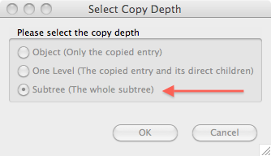
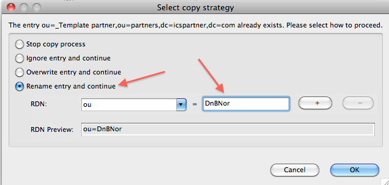
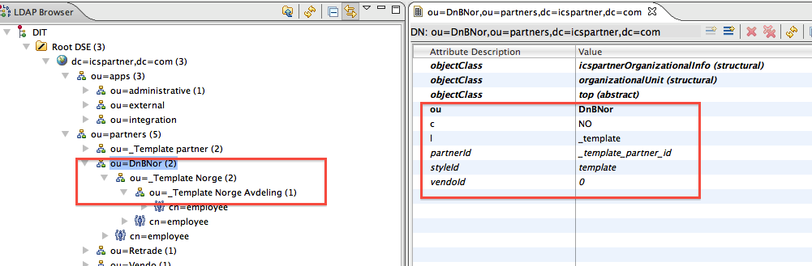
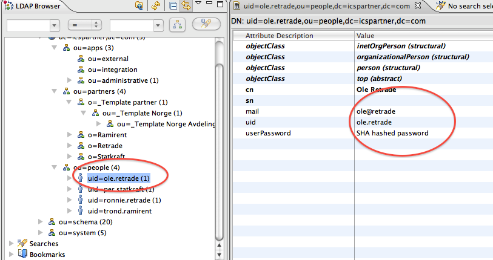

# Copy of Vedlikeholde partnere og brukere

# Dette er et ekstrakt fra ICS-prosjektet

Orginal: [retrade:(Vedlikeholde partnere og brukere)](../retrade/Vedlikeholde-partnere-og-brukere.md)

## Data registrert på bruker/partner

### Partnere

| attribut | eksempel | forklaring |
| --- | --- | --- |
| ou | Cramo Norge | ou=organisational unit. Navnet til organisasjonen, synlig i brukeradmin-treet |
| partnerId | ABC123 | Må være unik i hele ICS! Må ikke endres da produkter er relatert til id-en! Bruk "x"+navn+"tall" eller "x"+land+vendoid |
| vendoId | 1234 | Må matche IDen hos Vendo. Avdelinger som ikke har vendo-konto **skal ikke ha denne** |  |
| c | EE | c=country. Legg inn landkode med store bokstaver NO/SE/DK/FI/WW/LT/LV (det skjer en automatisk mapping av LT/LV/EE -> EU ifht. Vendo) |  |
| styleId | ramirent | Beskriver white-labling, pt. brukes i logo-navnet |  |
| l | localisation | Vises som partnernavn på skjermbilder og i lister |

### Brukere

| attribut | eksempel | forklaring |
| --- | --- | --- |
| cn | Ole Anders Kampelien | cn=common name |
| sn | Kampelien | sn=surename  (pt. ikke i bruk) |  |
| mail | oak@retrade.no |  |  |
| uid | ole.anders | innloggings-id - må være unik |  |
| userPassword | ****** |  |  |

Det finnes flere attributter som ikke er i bruk i PMen, men som kan benyttes av kundeservice, eks. fax, telephonenumber

## Administrasjon

Åpne Apache Studio - all bruker og parnterinformasjon ligger under _icspartner_ og hhv _partners_ og _people_

### Legge inn ny partner

Velg det stedet du skal legge inn en organisasjon, _partners_ hvis det er på toppen, evt. en eksisterende organisasjon om du skal legge inn en avdeling. Vi kan opprette en ny partner/avdeling ved å bruke "template" som mal. 

Velg den avdeling man skal kopiere på riktig nivå og trykk _Copy Entry_ 

Velg deretter den noden man skal lime den nye partner/avdeling inn på og velg _Paste Entry_

Kopier hele subtreet

I de fleste tilfeller sier systemet at man må endre navnet - legg inn det riktige navnet

Den nye strukturen skal nå være på plass. Husk at man må gå gjennom alle avdelingene og endre på **ou**, **l** (synlig på skjermbilder), **styleId**, **vendoId**, **c**, **partnerId**

Alle avdelinger skal ha en "rollegruppe" _employee_

### Legge inn ny bruker

Innlegging av brukere minner veldig om innlegging av partnere.

Finn en bruker du kan kopiere, evt. _template.user, høyreklikk og kopier

Lim inn brukeren under _people_ og velg _subtree (The whole subtree)_ i eget vindu som kommer opp

Legg inn riktig brukernavn

For å koble bruker til organisasjon og rolle så finner du organisasjonen og _employee_-gruppa. Høyreklikk og _copy_

Velg deretter brukerens _memberOfGroup_, dobbeltklikk på verdifeltet og lim inn vha _paste_

Velg deretter bruker-noden, og endre informasjon **cn**, **mail**, **userPassword**

### Bytte passord (eller annen info)

**NB** Ikke bytt brukernavn (uid) på en bruker som er i bruk!

- Klikk en gang på brukeren i LDAP-treet
- Dobbelklikk på verdien som skal endres. Noen ganger kommer det et pop-up-vindu (eks. passord), andre ganger kan man skrive rett inn i feltet 

