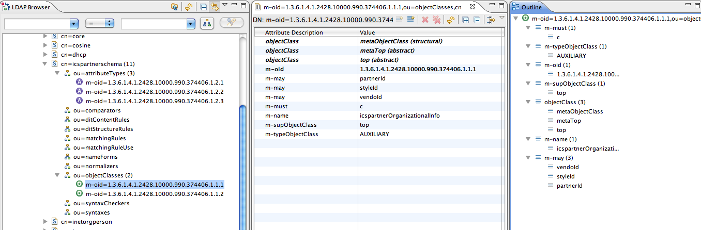
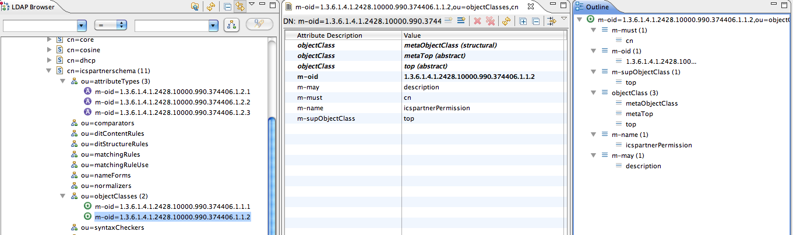
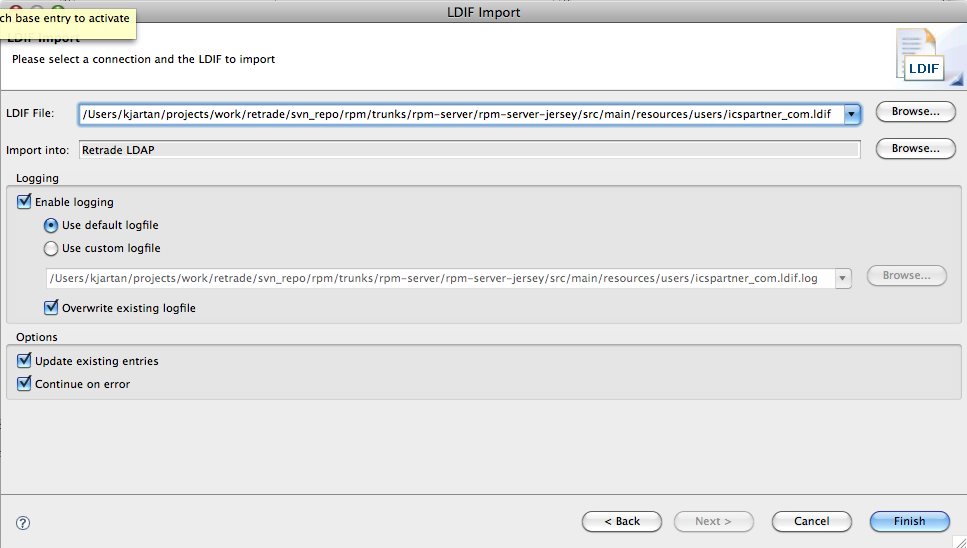

# Import av LDAP schema

#### Import av ICSPARTNERSCHEMA i Apache Directory Studio

Har lastet ned og installert Apache Directory Server 1.5.7. På OS X blir den installert som en [launchd](http://developer.apple.com/macosx/launchd.html) service som gjør at den automatisk startes ved oppstart og i tillegg når man installerer. Mao så kjører Apache DS automatisk etter installasjon. (veldig kjekt at de har valg å kalle produktene sine Apache Directory Server og Apache Directory Studio, da er det ingen tvil om hva man snakker om når man skriver Apache DS...)

For å stoppe ApacheDS så kjører man kommandoen:

```
sudo launchctl unload /Library/LaunchDaemons/org.apache.directory.server.plist
```

og for å starte:

```
sudo launchctl load /Library/LaunchDaemons/org.apache.directory.server.plist
```

Når den er installert så må kan man laste ned ApacheDS (Studio denne gang) som er en browser og directory klient. Når man har fyrt opp denne så oppretter man en LDAP connection mot den lokale serveren. Serveren kjører på {} og port `10389`, bruker er {} og passord {}:


Da ser det sånn noenlunde slik ut:


Deretter så importeres selve schema'et til Apache Directory Studio:


Mer details:






#### Import av data

Alt ser bra ut så langt så det neste som gjenstår er å importere den andre {} fila som inneholder test data.



Men det gikk ikke så bra.. 


Feilet med følgende

> ⚠️ ERR_268 Cannot find a partition for dc=icspartner,dc=com

Hele [retrade:loggen er vedlagt](18940328-icspartner_com.ldif.log) og første feil er:

```
#!RESULT ERROR
#!CONNECTION ldap://localhost:10389
#!DATE 2010-11-20T20:04:49.615
#!ERROR [LDAP: error code 32 - NO_SUCH_OBJECT: failed for     Add Request : ClientEntry     dn: dc=icspartner,dc=com     objectClass: organization     objectClass: dcObject     objectClass: top     dc: icspartner     o: ICSPartner : ERR_268 Cannot find a partition for dc=icspartner,dc=com]
dn: dc=icspartner,dc=com
objectClass: organization
objectClass: dcObject
objectClass: top
dc: icspartner
o: ICSPartner
```

#### Løsning

> 💡 Løsningen (for min del hvertfall) ble å legge til en egen {} i ApacheDS server.xml

Etter litt googling så kom jeg over denne linken om [hvordan man legger til egne partitions](http://directory.apache.org/apacheds/1.5/144-adding-your-own-partition-resp-suffix.html). Omsider så fant jeg at {} befant seg under `/usr/local/apacheds-1.5.7/instances/default/conf/server.xml`. Der la jeg inn følgende:

```
<jdbmPartition id="icspartner" cacheSize="100" suffix="dc=icspartner,dc=com" optimizerEnabled="true" syncOnWrite="true">
  <indexedAttributes>
    <jdbmIndex attributeId="1.3.6.1.4.1.18060.0.4.1.2.1" cacheSize="100"/>
    <jdbmIndex attributeId="1.3.6.1.4.1.18060.0.4.1.2.2" cacheSize="100"/>
    <jdbmIndex attributeId="1.3.6.1.4.1.18060.0.4.1.2.3" cacheSize="100"/>
    <jdbmIndex attributeId="1.3.6.1.4.1.18060.0.4.1.2.4" cacheSize="100"/>
    <jdbmIndex attributeId="1.3.6.1.4.1.18060.0.4.1.2.5" cacheSize="10"/>
    <jdbmIndex attributeId="1.3.6.1.4.1.18060.0.4.1.2.6" cacheSize="10"/>
    <jdbmIndex attributeId="1.3.6.1.4.1.18060.0.4.1.2.7" cacheSize="10"/>
    <jdbmIndex attributeId="dc" cacheSize="100"/>
    <jdbmIndex attributeId="ou" cacheSize="100"/>
    <jdbmIndex attributeId="krb5PrincipalName" cacheSize="100"/>
    <jdbmIndex attributeId="uid" cacheSize="100"/>
    <jdbmIndex attributeId="objectClass" cacheSize="100"/>
  </indexedAttributes>
</jdbmPartition>
```

For de av dere som er kjent på wiki'en så var nok dette kjent stoff, iom at det også [står omtalt her](../RPM/EU-template-image.md). Der står det også at man må disable _schemaInterceptor_

En restart av serveren og en ny import av {} i Apache Directory Studio gjorde susen :-)


\\
