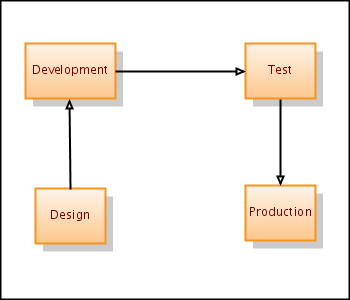

# Enterprise economy versus Project economy

Why agile projects fail to deliver expected values in an enterprise context

### Intro
When dealing with agile projects in the enterprise, the difference between enterprise economy and project economy becomes an important challenge. 

One common problem is that development is given too much attention. This often leads to increased test and production costs. A typical example is that when comparing two strategies the strategy that is easiest to implement is chosen. The increased test and deployment costs is ignored, because this cost often is outside the project scope. A term often used to describe such situations is **premature optimalisation**. 

---

### Scratcharea

Quickly summarized, we can look at some of the facts

- the project is measures on time&cost of 

- metrics of a project, developer
- incentives for 
- doing the right thing is always cheaper?
