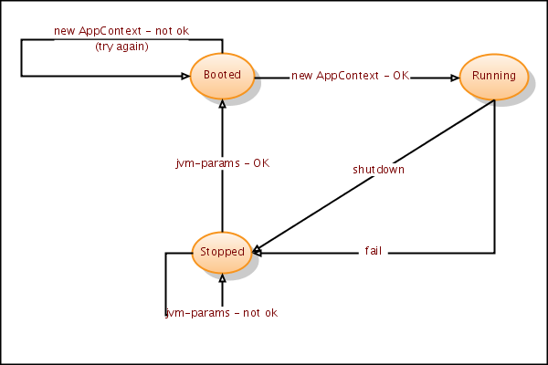

# States of a distributed application

> ℹ️ Remember the [The Eight Fallacies of Distributed Computing](http://michael.toren.net/mirrors/eight-fallacies-of-distributed-computing/) 

## Viewpoint: System Administrator 
This a **simplified** state diagram of what we want. A _Failed_ state should probably be added and ideally it should also be possible to recover and go back to _Running_ or at least the _Booted_ state. 

## Viewpoint: A common implementation 

This diagram shows how this often is implemented. Note that there **is** a _Failed_ state here, but the system cannot go anywhere from this state, thus requiring manual intervention. 

NOT an especially good solution

## References 

[Know When to Fail](http://programmer.97things.oreilly.com/wiki/index.php/Know_When_to_Fail)

[smidigtonull:Control state](../smidigtonull/Control-state.md)
