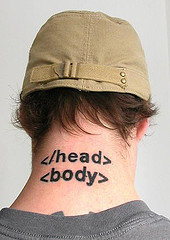

# The system development actors

### Interaction designer or User Experience (UX) person – the hero
_A guy who know why people click buttons and more importantly why they do not. Expert in building advanced interfaces with many properties and still make them look simplified and smooth._ 
**Primary concern:** That users should understand the interacrions in the nterface
**Most familiar with outputting:** Wireframes or paper prototypes
**Might be able to:** Create HTML and CSS
**Laughs at:** Designers– why build posters and banners when people need to understand the interaction?
**Loves most:** Speaking to users about his wireframes, using axure.com or Balsamiq

### Designer – the dreamer
_A guy or girl (Like your friend Stine or Remi i Think) who knows photoshop or inDesign by heart. Always using a Mac._
**Primary concern:** That pictures, icons and look and feel «feels right» and look good
**Most familiar with outputting:** Photoshop or InDesign files
**Might be able to:** Create a wix page
**Laughs at:** People still using HTML and CSS - let us use wix -and back end developers – why bother with something people do not see
**Loves most:** His Mac, photoshop and briefing with his fantastic photoshop sketches that no user will ever understand what does.

### Front end developer – the rockstar
_A guy who knows everything about HTML and CSS, something about Photoshop and InDesign, and nothing about CakePHP, Jetty or Neo4J_
**Primary concern:** Getting the front end to work on all devices and all clients
**Most familiar with outputting:** JavaScript, HTML and CSS
**Might be able to:** Build wireframes or photoshop design
**Laughs at:** Designers - why build posters and banners when people need to understand the interaction? Users – why talk to them? I know best.
**Loves most:** Beautiful code that generates a betufiful site that people actually use.

### Back end developer – the realist
_A guy who knows how to build databases, structure server side code, build services with high guaranteed uptime and great response time._
**Primary concern:** Structuring information and interactions in a meaningful way, making good and informed architecture decisions
**Most familiar with outputting:** Server side code such as PHP-code, Java-code or .Net-code.
**Might be able to:** Create HTML and CSS and hopefully JavaScript
**Laughs at:** Nobody, he is frustrated that the designer changed his mind after spending 5 hours trying to build what the designer first made.
**Loves most:** Code that does something magic, a beautiful algorithm that detects sick fish in a tank or how to aim your arms for example

### Architect – the visionair with both feet solid to the ground
_A guy (usually) who negotiates with the interaction designer, the designer, the front end developer and the back end develper and makes the touch choices on what technology to use, what frameworks to use._
**Primary concern:** That the sum of all small and big technological choices underbuilds the strategy
**Most familiar with outputting:** Decissions that makes it work and advice that moves us on.
**Might be able to:** Talk with others and actually produce code that is understandable .
**Laughs at:** Everybody, especially those who does not seem to know the definitions on the previous page,
**Loves most:** Reading articles about new frameworks and brief with his in extreme depth knowledge about everything.

### The evangelist - the enthusiastic speaker at the latest and greatest conference
_Someone who speaks about his latest or greatest technology at version 0.9 (for example Backbone.js) as if it will revolutionize how the world wide web is built._
**Primary concern:** Make people use the technology he is paid to hype
**Most familiar with outputting:** Speaches
**Might be able to:** Actually use what he is talking about, or even contribute to building the next iteration of the thing he is talking about.
**Laughs at:** Those who did not try his thing yet
**Loves most:** Himself
<TODO:Find photo>
